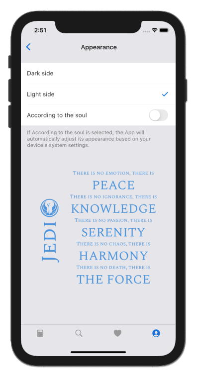
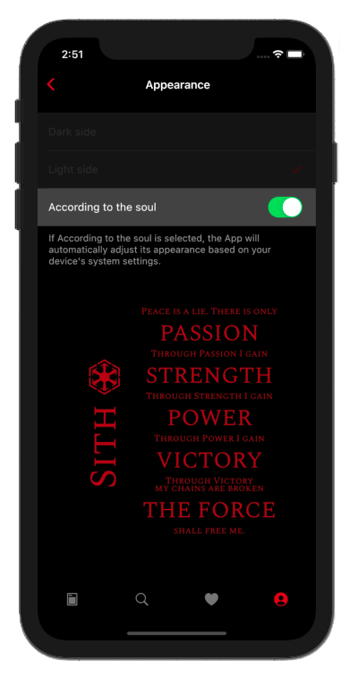

<h1 align=center> StarWars Wiki </h3>
 

 
  

  This application is being created for me  
  redeem myself from a <a href="https://flutter.dev/" target="_blank">Flutter</a> challenge that I did recently and did not do very well. 😅

 
 

# Flutter

This is a responsive <a href="https://flutter.dev/" target="_blank">Flutter</a> app, designed for devices with different screen sizes and types of interaction and it uses <a href="https://pub.dev/packages/hive" target="_blank">Hive</a> to store data locally.

 

# SWAPI

This application uses <a href="https://swapi.dev/" target="_blank">swapi.dev</a> to fill in its data. This application can show "planets, spaceships, vehicles, characters, movies, species" and their respective interactions.

 

# Hive Database

It saves this data using the <a href="https://pub.dev/packages/hive" target="_blank">Hive</a>, it is a "NoSQL database fast, pleasant and secure", I chose this database because it is "Cross platform: mobile, desktop, browser".

 

# Choose your side(theme)

You can choose your favorite theme to enjoy the App

  
  

# Images

I created a <a href="https://github.com/CaioMouraSud/starwarswiki/blob/main/lib/app/utils/image_generator.dart">class</a> to link photos about everything within this application, because StarWars without photos is not the same.

 

# Screenshots

This is the first part of the application running on an iOS Emulator and MacOS App

  
  

 

# Creators

Caio Moura

- <a href="https://github.com/caiomourasud" target="_blank">https://github.com/caiomourasud</a>
 
 

I hope you enjoy 🤘

